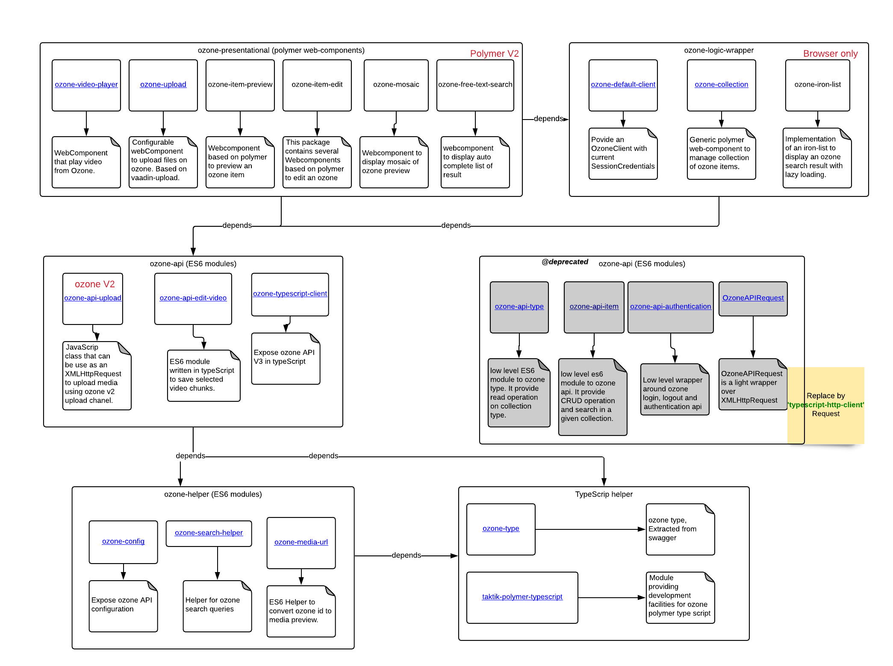

[](https://travis-ci.org/taktik/ozone-components)

# ozone-components

Ozone-components is a library of Polymer and TypeScript modules that should facilitate development of web front-end for Ozone.
Elements are available with TypeScript type definition.

Elements are split in 5 categories:

- ozone-api: Provide low level interface to Ozone server.
- ozone-material: provide paper material design to display specific Ozone content. (Based on Polymer V2)
- ozone-helper: provide generic class helper.
- ozone-logic: provide helper class for Ozone operation in side a web browser
- [ozone-typescript-client](packages/ozone-typescript-client): typescript module that manage connection and communication to ozone v3 API.



## Modules

- ozone-helper:

  - [ozone-type](packages/ozone-helper/ozone-type) Declaration of Ozone type.
  - [ozone-config](packages/ozone-helper/ozone-config) Expose Ozone API configuration. Configuration is loaded from `./conf.ozone.json`.
  - [ozone-search-helper](packages/ozone-helper/ozone-search-helper) Helper for Ozone search queries.
  - [taktik-polymer-typescript](packages/ozone-helper/taktik-polymer-typescript) Module providing development facilities for Ozone Polymer and TypeScript modules.
  - [ozone-api-request](packages/ozone-helper/ozone-api-request) (DEPRECATED) `OzoneAPIRequest` is a light wrapper over `XMLHttpRequest` to manager AJAX request to Ozone.
  - [ozone-media-url](packages/ozone-logic/ozone-media-url) Helper to convert Ozone id to media preview.

- ozone-api:
  - [ozone-typescript-client](packages/ozone-typescript-client) is a typescript module that manages connection and communication to ozone.
  - [ozone-api-type](packages/ozone-api/ozone-api-type) `ozone-api-type` (DEPRECATED) is a low level module to Ozone type API. It provides read operation on collection type.
  - [ozone-api-authentication](packages/ozone-api/ozone-api-authentication) (DEPRECATED) Low level wrapper around Ozone login, logout and authentication API.
  - [ozone-api-upload](packages/ozone-api/ozone-api-upload) `UploadFileRequest` is a JavaScript class that can be use as an `XMLHttpRequest` to upload media using Ozone v2 upload channel.
  - [ozone-api-edit-video](packages/ozone-api/ozone-api-edit-video) ES6 module written in TypeScript to save selected video chunks.
  - [ozone-api-item](packages/ozone-api/ozone-api-item) (DEPRECATED) Low level ES6 module to Ozone API. It provide CRUD operation and search in a given collection.
- ozone-logic (Browser only)

  - [ozone-collection](packages/ozone-logic/ozone-collection) Generic Polymer `web-component` to manage collection of Ozone items.
  - [ozone-iron-list](packages/ozone-logic/ozone-iron-list) Implementation of an `iron-list` to display an Ozone search result with lazy loading.
  - [ozone-default-client](packages/ozone-helper/ozone-default-client) Provide an OzoneClient with current SessionCredentials.

- ozone-material (Browser only)
  - [ozone-video-player](packages/ozone-material/ozone-video-player) WebComponent that play video from Ozone.
  - [ozone-free-text-search](packages/ozone-material/ozone-free-text-search) WebComponent that play video from Ozone.
  - [ozone-upload](packages/ozone-material/ozone-upload) Configurable WebComponent to upload media files on Ozone. Based on `vaadin-upload`.
  - [ozone-item-preview](packages/ozone-material/ozone-item-preview) Webcomponent based on Polymer to preview an Ozone item.
  - [ozone-item-edit](packages/ozone-material/ozone-item-edit) This package contains several WebComponents based on Polymer to edit an Ozone item.
  - [ozone-mosaic](packages/ozone-material/ozone-mosaic) Webcomponent to display mosaic of Ozone preview.

## Get started

This project contains a set of npm library that can be installed individually.
There are aimed to be builded with webpack.
See the [demo project](demo.html) for webpack configuration example.

## usage

Install package from npmjs.com with `npm` or `yarn`.

All the components are generated in ES6 and esnext modules. **Your project should support ES6/esnext.**

### usage in frontend

**Use webpack to transpile in older JS !!**

babel.config.js babel config in **js** is require to transpile node_modules.

webpack.config.js

```javascript
{
  test: /\.js$/,
  use: {
     loader: 'babel-loader',
  },
  exclude: /node_modules\/(?!.*(ozone|helpful-decorators).*)/,
},
```

### usage in node.js

**A. Import esnext modules !!**

Option 1: Using ESM

```javascript
require = require("esm")(module /*, options*/);
```

Option 2: Using Babel like in frontend

**B. Polyfill**

```javascript
const XMLHttpRequest = require("xhr2-cookies").XMLHttpRequest;
global.XMLHttpRequest = XMLHttpRequest;
global.window = {};
global.window.console = console;
global.window.setTimeout = setTimeout;
global.window.setInterval = setInterval;
global.window.clearTimeout = clearTimeout;
global.Document = function () {};
```

## Contribute

Any contribution and comment are welcomed.

Do not hesitate to report issues and ask questions in previously reported issues.

You are also more than welcomed to suggest fixes through pull requests.

### A Lerna project

`ozone-components` are centralized in a Lerna repo. Please refer to Lerna documentation for generic usage such as project import, dependency installation or project bootstraping.

### Set up

```bash
 yarn setup
```

### Clear node_modules folders

```bash
  yarn clean
```

### Viewing demo Application

```bash
yarn demo
```

Open a browser in http://localhost:9000

### Running Tests

```
yarn test
```

### Generate documentation

```bash
yarn doc
```

### Publish

We use Lerna to publish ozone-components packages.
At first, make sure to set up correctly your project. (see #setup section)

```bash
yarn lerna:publish
```

Then publish the documentation on gcloud

```bash
yarn doc:publish
```

### Using yarn/npm link to use an ozone-components package in a localhost admin/frontend

If you need to make changes inside an ozone-components package, and you want to test it in a local front/admin
you can use `yarn link` to reflect the changes made to the package to the front/admin  :

* In the ozone-component package you want to change, at the root of the package : `yarn link`
* In the project you want to use that package (flowr-admin / flowr-frontend), at the root : `yarn link "package_name"`
* When finished, use `yarn unlink` in the ozone-component package root (Or in flowr, use the `npm run setup` command to override the packages files)

Example for "ozone-iron-list"
* In `ozone-components/packages/ozone-logic/ozone-iron-list` use `yarn link`
* In `flowr/flowr-admin` use `yarn link "ozone-iron-list"`

#### Issues with the link
If you get an error looking like this :
```
Argument of type 'import("/flowr/package/path").Function' is not assignable to parameter of type 'import("/ozone-component/package/path").Function'.
Types of property 'some_property_name' are incompatible.
Types have separate declarations of a private property 'some_property_name'.
```

It means there is a conflict in the package source files which should be used. [There is a solution](https://github.com/Microsoft/typescript/issues/6496#issuecomment-384786222)
detailed here :

In the project that will use the ozone-component (admin/front), in the `tsconfig.json` add the lines (inside the `compilerOptions` object) :
```
"paths": {
    "package_name": ["node_modules/package_name"]
}
```

Example :
```
{
  "compilerOptions": {
    "someOptions": "...",
    "paths": {
        "ozone-search-helper": ["node_modules/ozone-search-helper"]
    }
  }
}

```
