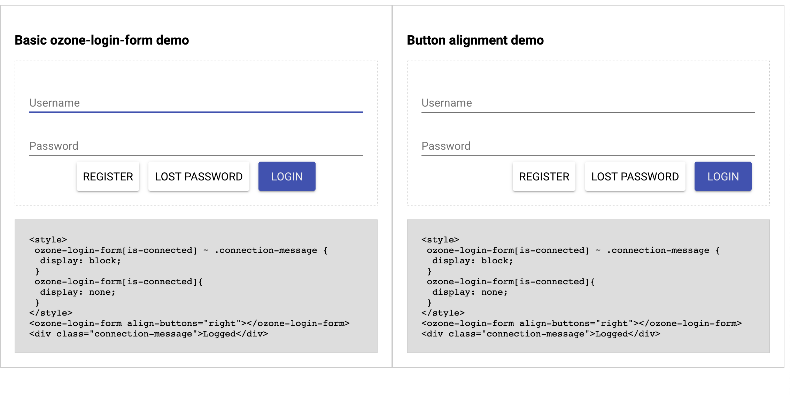

# ozone-login

Polymer webComponents for Login / logout to Ozone

## install

```bash
npm install --save ozone-login
```
## usage

### ozone-login-form

```typescript
import "ozone-login/dist/ozone-login-form"
```
```css
	ozone-login-form[is-connected]{
		display: none;
	}
```
```html
  <ozone-login-form
        on-register-clicked="..."
        on-password-clicked="..."
        align-buttons="right|center|left"
        username-label="..."
        password-label="..."
        register-label="..."
        lost-password-label="..."
        submit-label="..."
        message-on-empty="..."
        message-on-invalid="..."
        message-on-unknown="..."
       >
  </ozone-login-form>
```


### ozone-logout-form

```typescript
import "ozone-login/dist/ozone-logout-form"
```
```css
	ozone-logout-form:not([is-connected]){
		display: none;
	}
```
```html
  <ozone-logout-form>
     <button type="button">LOGOUT</button>
  </ozone-logout-form>
```

## demo

```bash
npm run demo
```

