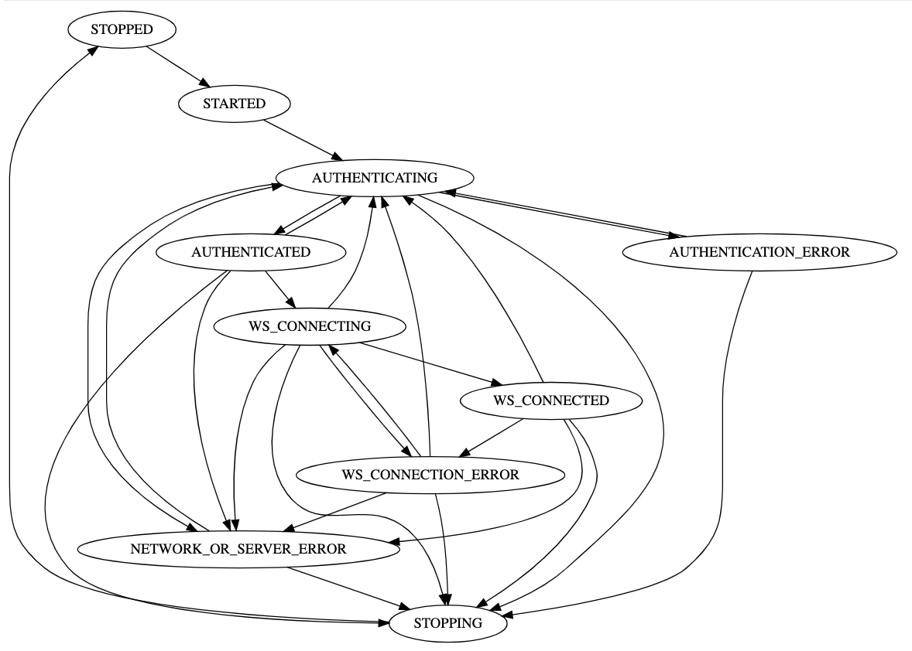

[![NPM version][npm-image]][npm-url]
# ozone-typescript-client


`ozone-typescript-client` is a typescript module that manage connection and communication to ozone v3 API.

## State machine




## Interface

```typescript
export interface OzoneClient extends StateMachine<ClientState> {

	/* Get the client config */
	readonly config: ClientConfiguration

	/* Get the current Authentication if available */
	readonly authInfo?: AuthInfo

	/* Get the last failed login call if any */
	readonly lastFailedLogin?: Response<AuthInfo>

	/*
        Convenience props for getting the status of the client.
    */
	readonly isAuthenticated: boolean
	readonly isConnected: boolean

	/*
        Start the client. To be called once
    */
	start(): Promise<void>

	/*
        The array of filters to apply to all HTTP calls
        BEFORE this OzoneClient's own internal filters.
        This array can be modified at any time to add/remove filters
     */
	readonly preFilters: InstalledFilter[]

	/*
        The array of filters to apply to all HTTP calls
        AFTER this OzoneClient's own internal filters.
        This array can be modified at any time to add/remove filters
     */
	readonly postFilters: InstalledFilter[]

	/*
        Update the WS URL.
        The client will attempt to connect automatically to the new URL.
    */
	updateWSURL(url: string): void

	/*
        Update the Ozone credentials.
        The client will attempt to login automatically.
    */
	updateCredentials(ozoneCredentials: OzoneCredentials): void

	/*
        Stop the client. To be called once
    */
	stop(): Promise<void>

	/*
        Perform a low-level call
        All calls towards Ozone or other Microservices secured by Ozone should use those calls
    */
	callForResponse<T>(request: Request): Promise<Response<T>>

	call<T>(request: Request): Promise<T>

	/*
        Register a message listener.

        @param messageType The type of message to register for
        @param callBack The callBack that will be called
    */
	onMessage<M extends DeviceMessage>(messageType: string, callBack: (message: M) => void): ListenerRegistration

	onAnyMessage(callBack: (message: DeviceMessage) => void): ListenerRegistration

	/*
        Send a message
    */
	send(message: DeviceMessage): void

	// BEGIN HIGH LEVEL CALLS

	/*
        Get a client for working with items of the given type
    */
	itemClient<T extends Item>(typeIdentifier: string): ItemClient<T>
	/*
        Get a ``lob`` for working with blob
    */
	blobClient(): BlobClient

	/*
    	Get a client for working with role
	*/
	roleClient(): RoleClient

	/**
	 * get client to work with type
	 */
	typeClient(): TypeClient

	/**
	 * get task client to wait manage task
	 */
	taskClient(): TaskClient

	/**
	 * get client to work with permission
	 */
	permissionClient(): PermissionClient

	/**
	 * get client to work with permission
	 */
	importExportClient(): ImportExportClient

	/**
	 *  file file type client
	 */
	fileTypeClient(): FileTypeClient

	/*
        Insert the current Ozone session ID in the given URL ("/dsid=...).
        This call throws an error if there is no session available.
        The given string may or may not contain the host part.
        Example input strings :
        "/rest/v3/blob"
        "https://taktik.io/rest/v2/media/view/org.taktik.filetype.original/123"
    */
	insertSessionIdInURL(url: string): string
}
```

## Usage

### Initialization example:
```typescript
import { OzoneClient } from 'ozone-typescript-client'
import UserCredentials = OzoneClient.UserCredentials
import OzoneCredentials = OzoneClient.OzoneCredentials
import ClientConfiguration = OzoneClient.ClientConfiguration
import newOzoneClient = OzoneClient.newOzoneClient

let client: OzoneClient.OzoneClient
async function init() {
const credentials = new UserCredentials('ozoneUser', 'ozonePassword')
		const config: ClientConfiguration = {
			ozoneURL: `http://my.ozone.domain/ozone`,
			ozoneCredentials: credentials
		}
		client = newOzoneClient(config)
		await client.start()
}
```

### Using API client example:
```typescript
import { OzoneClient } from 'ozone-typescript-client'
import { Video, toPatch } from 'ozone-type'

declare function getClient(): OzoneClient.OzoneClient

const videoClient = getClient().itemClient<Video>('video')
const myOriginalVideo = await videoClient.findOne('uuid-yyyy-zzz')
const videoToUpdate = toPatch(myOriginalVideo)
videoToUpdate.name = 'a new name'
const updatedVideo = await videoClient.save(videoToUpdate)
```

### login application example
```typescript
import { once } from 'lodash'
import { OzoneClient } from 'ozone-typescript-client'
import UserCredentials = OzoneClient.UserCredentials
import ClientStates = OzoneClient.states
import { getDefaultClient } from 'ozone-default-client'

export class PageLoginDefault extends Polymer.Element {
  /* ... */

  ready(): void {
     super.ready()
     const defaultClient = getDefaultClient()
     defaultClient.onEnterState(ClientStates.STOPPED,() => {
        this.set('isConnected', false)
     })
     defaultClient.onEnterState(ClientStates.AUTHENTICATED,() => {
        this.set('isConnected', true)
     })
     if (defaultClient.authInfo) {
        this.set('isConnected', true) // client is already logged
     }
  }

  public async submitForm(e: Event): Promise<void> {
        /* ... */
     const updateMessagesOnError = once(() => {
        this.set('isConnected', false)
        const err = defaultClient.lastFailedLogin
        if (err && err.status === 400) {
           this.set('errorMessage', this.localized.msgEmptyCredentials)
        } else if (err && err.status === 403) {
           this.set('errorMessage', this.localized.msgInvalidCredentials)
        } else {
           this.set('errorMessage', this.localized.msgUnknownError)
        }
     })

     const defaultClient = getDefaultClient()
     defaultClient.onEnterState(ClientStates.AUTHENTICATION_ERROR, updateMessagesOnError)
     const userCredentials: UserCredentials = new UserCredentials(this.username, this.password)
     defaultClient.updateCredentials(userCredentials)
     try {
           // start if needed
        await defaultClient.start()
     } catch (err) {
           // error are handle inside the client state machine
     }
  }
}
```

## Install

```
$ npm install --save ozone-typescript-client
```

[npm-image]: https://badge.fury.io/js/ozone-typescript-client.svg
[npm-url]: https://npmjs.org/package/ozone-typescript-client
